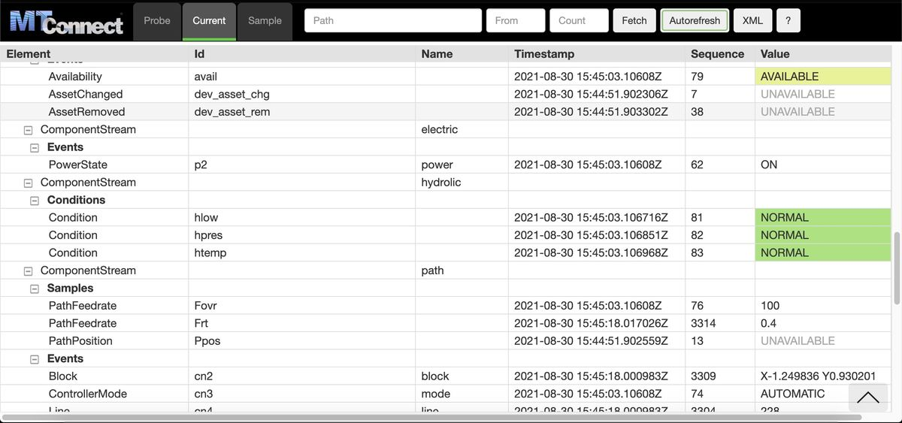

# MTConnect Agent Stylesheet

Stylesheet for the MTConnect Agent - transforms XML data to a grid UI - with tabs for Probe, Current, and Sample endpoints. Uses [Bootstrap](http://getbootstrap.com/) CSS for some styling.



## Note

Windows had trouble handling the xsl:include statements, like

  <xsl:include href="styles-probe.xsl" />

it appends extra text at the end of the xml, confusing the browser. So copied/pasted that code into the main styles.xsl file.

Windows also had trouble rendering the small png, gif, and jpg files, so changed those to icos. 


## Installation

1. Copy the contents of this repository into the "Styles" folder for the MTConnect Agent.

2. Edit the Agent's configuration file (e.g. agent.cfg) to look for the stylesheets as shown below:

```
Files {
    styles {
        Path = ../styles
        Location = /styles/
    }
    Favicon {
        Path = ../styles/favicon.ico
        Location = /favicon.ico
    }
}

DevicesStyle { Location = /styles/styles.xsl }
StreamsStyle { Location = /styles/styles.xsl }

```

3. Restart Agent
4. Navigate to Agent's url to view


## Smart Saw Connect browser view

`viewer.html`, `viewer.css` and the `mtc-*.js` modules are the JavaScript browser view proposed for the cppagent in [mtconnect/cppagent#621](https://github.com/mtconnect/cppagent/pull/621), copied from commit `56f5fa97`. It replaces `styles.xsl` for browsers that no longer support XSLT (Chrome 158 and later). `viewer.html` is patched for Smart Saw (logo, title, favicon, help text), and `theme.css` holds the brand colors. Keep both changes small so later updates from the cppagent are easy to merge.

It needs an agent build that includes #621. Add this to the agent configuration, next to the `Files` entries above:

```
BrowserView { Location = /styles/viewer.html }
```

Without that build the files are not used and `styles.xsl` keeps working.

## Todo

- click row to highlight and switch between current and probe views
- handle all non-standard dataitem elements with generic subtables (currently each subtable type is hardcoded)
- try nbsp instead of white 'x' for indentation
- set max-width for id column and truncate with ellipsis? what set at though? what if someone has wide monitor?
- handle collapsible sections


## Contributing

Note: The MTConnect cppagent doesn't allow using subfolders in the styles folder, so keep it flat.

## License

MIT
